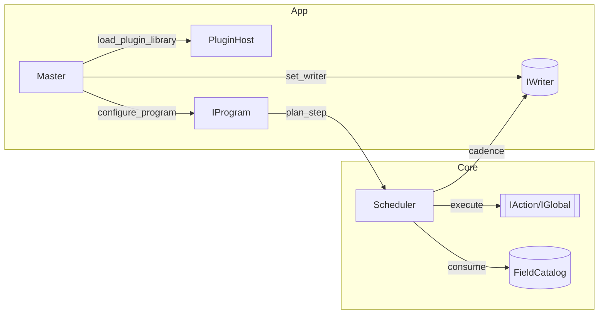

# `src/core/` Core Orchestration & I/O — Developer Guide

This guide explains how the **core** of the solver is structured and how to extend it. It focuses on
developer-facing concerns: software patterns, module boundaries, build modes (MPI/CUDA), memory
handling, orchestration, and the I/O subsystem.

---

## Directory map

```text
src/core/
├─ include/
│  ├─ master/                      # orchestration & plugin-facing API
│  │  ├─ Master.hpp                # app façade
│  │  ├─ Scheduler.hpp             # time loop + phase runner
│  │  ├─ RunContext.hpp            # MPI/device/memory handles (opaque in headers)
│  │  ├─ FieldCatalog.hpp          # registry of fields + POD views
│  │  ├─ Views.hpp                 # ABI-safe POD types (AnyFieldView, MeshTileView, …)
│  │  ├─ PluginHost.hpp            # loader for physics DSOs (registry owner)
│  │  └─ plugin/
│  │     ├─ Action.hpp             # IAction / IGlobal + Access + Phase bitmask
│  │     ├─ Program.hpp            # IProgram → StepPlan (tiled & global actions)
│  │     └─ Registry.hpp           # runtime factories + exported register symbol
│  ├─ io/                          # I/O contracts and concrete backends
│  │  ├─ IWriter.hpp               # writer interface (open_case / write / close)
│  │  ├─ WriterConfig.hpp          # backend selection, precision policy, options
│  │  ├─ WritePlan.hpp             # per-field layout/size plan synthesized from views
│  │  ├─ StagingPool.hpp           # page-aligned reusable host buffers
│  │  ├─ AsyncWriter.hpp           # threaded decorator w/ backpressure
│  │  ├─ XdmfHdf5Writer.hpp        # HDF5 data + XDMF XML index 
│  │  ├─ CGNSWriter.hpp            # CGNS writer 
│  │  ├─ ConfigYAML.hpp            # YAML input parser with yaml-cpp
│  │  ├─ NullWriter.hpp            # no-op writer for testing core / fallback if no writer
│  │  └─ Preflight.hpp             # RAM/disk sanity checks
│  ├─ memory/                      # memory model and resource manager
│  │  ├─ AlignedAlloc.hpp          # aligned/new/delete wrappers
│  │  └─ MemoryManager.hpp         # unified/mirrored/pinned strategies + registry
│  └─ mesh/                        # structured grid model
│     ├─ Layout.hpp                # Indexer3D (i-fastest) linearization helpers
│     ├─ Field.hpp                 # typed, non-owning view with ghosts
│     ├─ Boundary.hpp              # face-wise ghost filling (Dirichlet/Neumann/Extrapolate/Mirror)
│     ├─ Mesh.hpp                  # interior sizes + ghost width
│     └─ HaloExchange.hpp          # 6-face MPI exchanges
└─ src/                            # implementations (.cpp only include heavy deps)
```

**Notes**

* Public headers avoid `<mpi.h>`, HDF5, CGNS, CUDA, etc. Those are included only in `.cpp` files
  and guarded by build flags (e.g., `HAVE_CUDA`, `USE_CUDA_UM`).
* Everything exposed to plugins/writers uses **trivial/ABI-stable** types.

---

## Design principles

1. **ABI-safe boundaries.** Headers shared with plugins/writers expose *only* trivial structs,
   `std::string` by value where needed, and no templates in the ABI surface.
2. **Dependency isolation.** Heavy headers are kept out of public headers and compiled only where
   used, under feature guards.
3. **Single ownership of storage.** The application/core owns field arrays; plugins and writers get
   non-owning **views** and must not free storage.
4. **Coarse-grained execution.** The scheduler drives a small number of virtual calls per **tile**
   and **step**; actions own their internal kernels/copies.
5. **Uniform ghosts, 3-D blocks.** Memory layout assumes a cartesian block and *uniform ghost width*
   `ng` across axes; totals include ghosts.

---

## Data model & memory (expanded)

### Layout & addressing

* **SoA linearization:** `Indexer3D` in `Layout.hpp` maps `(i,j,k)` to a linear index with *i* as the
  fastest dimension:

  ```cpp
  // totals include ghosts; i,j,k are 0-based in ghost-inclusive coordinates
  idx(i,j,k) = (k * Ny_tot + j) * Nx_tot + i;
  ```

* **Ghosts:** For an interior box `{nx,ny,nz}` and ghost width `ng`, the allocated totals are
  `{nx+2ng, ny+2ng, nz+2ng}`. Accessors translate interior indices to ghost-inclusive addresses.

### `mesh::Field<T>` — typed view over ghosted storage

* **Purpose:** zero-overhead, **non-owning** typed wrapper over a raw pointer and totals (+`ng`).
* **Key API:**

  * `Field(T* data, std::array<int,3> totals, int ng)` — construct from raw storage.
  * `T& operator()(int i,int j,int k)` — interior indexing (applies `ng` shift internally).
  * `std::span<T> span()` — flat view over the entire ghost-inclusive block.
  * `T* raw() const` — typed pointer for interop (e.g., Fortran `bind(C)`).
  * `extents()` / `ng()` — metadata queries.
* **Usage:** All boundary and packing code **delegates indexing** to `Field<T>` so there is a single
  source of truth for layout.

### `master::AnyFieldView` & `FieldCatalog` — ABI views for orchestration & I/O

* **AnyFieldView:** POD with: `name`, `host_ptr`, `elem_size` (bytes), logical extents `{nx,ny,nz}`,
  and **byte** strides `{sx,sy,sz}`. Strides are in bytes to avoid `sizeof` confusion.
* **FieldCatalog:** registry of `AnyFieldView` plus a **selection set** for outputs.

  ```cpp
  FieldCatalog fc;
  fc.register_scalar("rho", rho_ptr, sizeof(double), {nx,ny,nz},
                     { 8, 8*nx, 8*nx*ny });
  fc.select_for_output("rho");
  auto views = fc.selected_for_output();
  ```

### `memory::MemoryManager` — residency & transfers

> The MemoryManager centralizes host/device allocation policies and keeps a pointer registry so
> plugins/writers can resolve **device mirrors** or request **prefetch/copies** using the same
> stream/queue as the core. Exact signatures live in `MemoryManager.hpp`; below is the contract.

#### Build-time strategies

* **CPU-only:** plain page-aligned host allocations; `to_device`/`to_host` are no-ops.
* **CUDA Unified Memory** (`HAVE_CUDA && USE_CUDA_UM`): allocations come from `cudaMallocManaged`.

  * **Prefetch:** `to_device(ptr, n, stream)` issues `cudaMemPrefetchAsync(ptr, n, dev, stream)`;
    `to_host` prefetches to `cudaCpuDeviceId`.
  * **Advice (optional):** writers/actions may call `advise_read_mostly`/`advise_preferred_location`.
* **CUDA Mirrored:** separate host/device allocations with a registry mapping `host_ptr → device_ptr`.

  * `to_device(host_ptr, bytes, stream)` enqueues `cudaMemcpyAsync(dev, host, ...)` on the provided
    stream; `to_host` does the reverse.
  * Host buffers can be **pinned** (via `cudaHostAlloc`) to enable true async copies.

#### Primary entry points (conceptual)

* **Allocation/adoption**

  * `void* allocate_host(std::size_t bytes, std::size_t alignment)` — page-aligned host
    allocation (falls back to `aligned_alloc`/`posix_memalign`).
  * `void* allocate_um(std::size_t bytes)` — Unified Memory (if enabled).
  * `Mirror add_mirror(void* host_ptr, std::size_t bytes)` — create/register device mirror for a
    host block and return descriptors (UM path returns the same pointer twice).
  * `void register_external(void* host_ptr, std::size_t bytes)` — adopt externally created blocks
    (e.g., arrays allocated by the application); enables later migration/copies.
  * `void free_all()` / `void free(void* host_ptr)` — lifetime management; a thread-safe
    registry tracks all blocks.

* **Residency & transfers**

  * `void* device_ptr(void* host_ptr)` — resolve device mirror of a host block (UM ⇒ `host_ptr`).
  * `void to_device(const void* host_ptr, std::size_t bytes, void* stream)` — prefetch/copy to GPU.
  * `void to_host(const void* host_ptr, std::size_t bytes, void* stream)` — prefetch/copy to host.

* **Thread-safety & streams**

  * A mutex protects the registry; transfers take an optional **opaque** `stream` (e.g.,
    `cudaStream_t`) which is passed in from `RunContext` so all subsystems use the **same** queue.

#### Packing & staging (used by I/O)

* `WritePlan` marks each field **contiguous** or **non-contiguous**; non-contiguous fields are
  **packed** into page-aligned buffers provided by `StagingPool`.
* **Precision cast:** When `WriterConfig::precision` requests `float32`, packing converts elements
  on the fly (`double → float`).
* **UM vs Mirrored:** On UM, the writer can directly read host pointers after `to_host` prefetch.
  On Mirrored, writers typically work from **host** staging to avoid device-side reads from I/O.

### Boundary & halo helpers

* **Boundary operators** (`Boundary.hpp`): face-wise fills for scalar and vector fields.

  * `Dirichlet`, `NeumannZero` (copy), `Extrapolate1` (linear), and `Mirror` for vectors with
    per-component parity (e.g., slip wall `{-1,+1,+1}`).
  * All loops delegate indexing to `Field<T>`; ghosts must be **uniform**.
* **Halo exchange** (`HaloExchange.hpp`): 6-face, nonblocking exchanges.

  * Uses `MPI_Isend/Irecv/Waitall`; communicator comes from `RunContext::mpi_comm`.
  * **CUDA-aware MPI**: if `rc.cuda_aware_mpi` is true and UM/mirrors are used, the exchange layer
    can post directly on device/UM buffers; otherwise it stages through host.

---

## Orchestration layer

### RunContext (immutable during a run)

Opaque handles kept as `void*` to keep headers light:

* `mpi_comm` (e.g., `MPI_Comm*` cast within MPI-guarded `.cpp` only),
* `device_stream` (e.g., `cudaStream_t` or similar),
* `mem` (`core::memory::MemoryManager*`),
* convenience flags (`cuda_aware_mpi`, world rank/size).

Treat `RunContext` as **read-only** during a run; to replace a stream/communicator, rebuild the
`Scheduler` with a fresh context.

### Plugin API (actions & programs)

* **Action:** implements `IAction::execute(tile, fields, dt)` and declares `ActionInfo`:

  * `Phase` bitmask: `PreExchange | Interior | PostExchange | PostBC | EndStep`.
  * `Access` (reads, writes, per-field halo depth). The scheduler uses this to place actions and
    ensure ghost cells are valid before execution.
* **Global:** implements `IGlobal::run(fields, dt)` for non-tiled reductions/diagnostics.
* **Program:** returns a `StepPlan` (vectors of tiled actions and globals) for each step.

Registration is DSO-based via `physics_register_v1`.

### Loader & registry

`PluginHost` owns OS handles (`dlopen`/`LoadLibrary`) and the `plugin::Registry`. The app calls
`load_plugin_library(path)` and later `make_program(key, cfg, rc)` to instantiate the selected
program.

### Scheduler (time loop & phases)

1. **PreExchange:** rare hooks before posts.
2. **Halo exchange:** (MPI builds only) exchange ghosts for all registered fields.
3. **Interior:** run actions safe to overlap with halo traffic.
4. **PostExchange** → **BCs** → **PostBC** → **EndStep**.
5. **Writer cadence:** on `write_every`, emit selected views.

Implementation notes:

* The tile currently spans the local interior box; tiling can be added without ABI changes.
* Steps are computed as `round(t_end / dt)`; writer receives `{step,time}` tuples.

### Master (façade for apps)

`Master` wires `RunContext`, `Mesh`, `FieldCatalog`, `PluginHost`, `Scheduler`, and the `IWriter`.

```cpp
core::master::RunContext rc{};
core::mesh::Mesh mesh; mesh.local = {nx,ny,nz}; mesh.ng = ng;
core::master::Master M(rc, mesh);

M.fields().register_scalar(...);
M.fields().select_for_output("rho");

auto W = std::make_unique<io::XdmfHdf5Writer>(cfg);
M.set_writer(std::move(W));

M.load_plugin_library("libphysics.so");
M.configure_program("explicit_rk3", {{"cfl","0.7"}});

core::master::TimeControls tc{.dt=1e-3, .t_end=1.0, .write_every=10};
M.run(tc);
```

`set_writer()` re-binds the scheduler to avoid dangling references.

---

## I/O subsystem

### YAML input

The app parses a YAML file into `AppConfig` (see `master/io/ConfigYAML.hpp`) and wires it to core. The **`io:`** section controls the writer selection, output path, precision override, background mode, and resource checks.

```yaml
io:
  backend: xdmf          # xdmf | cgns | null
  path: out              # output directory (created if missing)
  precision: native      # native | float64 | float32 (packing override)
  async:                 # optional background writer
    enabled: true
    max_queue: 8         # 0 = unbounded
    drop_on_overflow: true  # drop writes when queue is full (protect cadence)
  preflight:             # optional RAM/disk checks before long runs
    enabled: true
    ram_bytes: auto      # auto | integer bytes (e.g., "17179869184")
    disk_bytes: auto     # auto | integer bytes
```

**Semantics**

* `backend`: choose writer implementation. `null` keeps the run I/O‑free (useful for kernel testing).
* `path`: base directory for artifacts (HDF5/CGNS + indices); created on `open_case()`.
* `precision`: `native` keeps element size; `float64`/`float32` request packing casts.
* `async`: wraps the chosen backend with a worker thread. `max_queue` bounds enqueued steps; when `drop_on_overflow` is true, excess writes are dropped to protect cadence.
* `preflight`: estimates bytes/step from the current `FieldCatalog` selection (via `WritePlan`) and compares with available RAM/disk. `auto` probes the host; literal byte values override the probe.

**App wiring (excerpt)**

```cpp
AppConfig cfg = load_config_from_yaml(path);

// Build WriterConfig
WriterConfig w{};
w.backend = to_writer_backend(cfg.io.backend);
w.path    = cfg.io.path;
if (cfg.io.precision==AppConfig::Precision::F32)
  w.precision = WriterConfig::Precision::Float32;
else if (cfg.io.precision==AppConfig::Precision::F64)
  w.precision = WriterConfig::Precision::Float64; // else leave native

// Construct writer (+ optional async) and attach to Master
std::unique_ptr<IWriter> sink =
  (cfg.io.backend==AppConfig::Backend::Xdmf) ? std::make_unique<XdmfHdf5Writer>(w) :
  (cfg.io.backend==AppConfig::Backend::Cgns) ? std::make_unique<CGNSWriter>(w)     :
                                              std::make_unique<NullWriter>();
if (cfg.io.async.enabled) {
  AsyncWriter::Options opt{ /*max_queue=*/cfg.io.async.max_queue,
                            /*drop_to_null_on_overflow=*/cfg.io.async.drop_on_overflow };
  sink = std::make_unique<AsyncWriter>(std::move(sink), opt);
}
master.set_writer(std::move(sink));

// Optional RAM/disk preflight
auto views = master.fields().selected_for_output();
std::size_t override_b = (cfg.io.precision==AppConfig::Precision::F32) ? 4 :
                         (cfg.io.precision==AppConfig::Precision::F64) ? 8 : 0;
WritePlan plan = build_write_plan({views.data(), views.size()}, override_b);
/* run_preflight(w, plan, world, avail_ram, avail_disk) */
```


### IWriter contract

Writers are sinks that receive **host-side** `AnyFieldView`s and write a time series:

```cpp
struct WriteRequest { int step; double time; std::vector<AnyFieldView> fields; };
struct IWriter {
  virtual void open_case(const std::string& case_name) = 0;
  virtual void write(const WriteRequest& req) = 0; // synchronous in base API
  virtual void close() = 0;
};
```

### WritePlan & staging

`WritePlan` is synthesized from selected views and (optionally) a **precision policy**. It captures
logical extents, **byte** strides, contiguity, and per-field byte counts. Writers use the plan to:

* choose **direct** writes (contiguous, matching element size) vs **staging**,
* size the `StagingPool` (page-aligned buffers reused across steps),
* apply optional `float64↔float32` casts during packing.

### Built-in writers

* **XdmfHdf5Writer** : writes datasets per step to HDF5 and maintains an
  XDMF XML index.
* **CGNSWriter** : writes a structured zone, then per-step FlowSolutions.

Both use `WriterConfig` (backend, precision override, output path, series policy, compression, …).

### AsyncWriter decorator

Wraps any `IWriter` and moves `write()` calls to a worker thread with a bounded queue and optional
backpressure policy. `open_case()` starts the worker; `close()` flushes and joins.

### Preflight checks

Computes total bytes per step and verifies headroom against available RAM/disk; can warn or abort
based on policy.

---

## Build modes & feature flags

* **CUDA / UM:** `HAVE_CUDA`, `USE_CUDA_UM` control MemoryManager paths (UM vs mirrored), prefetch,
  pinned host staging, and CUDA-aware MPI choices.

---

## Conventions

* **Byte strides** everywhere in I/O (`sx,sy,sz`).
* **Uniform ghosts** in BC/halo logic.
* **Host pointers** in views belong to the core; plugins/writers must not free.
* **Streams:** use the `RunContext` stream for kernels and copies to keep ordering consistent.
* **Forward declarations** in headers; include heavy dependencies only in `.cpp`.

---

## Extending the core

* **New action:** implement `IAction`, fill `ActionInfo{ name, phases, access }`, register in
  `physics_register_v1`.
* **New program:** implement `IProgram::plan_step(dt)` and assemble a `StepPlan`.
* **New writer:** subclass `IWriter`, build a `WritePlan` in the first `write()`, allocate a
  `StagingPool`, implement `open_case`/`write`/`close`. Optionally wrap with `AsyncWriter`.

---

## Typical control flow



---

## Pitfalls & tips

* Don’t include `<mpi.h>` in headers; keep it in MPI-guarded `.cpp` files.
* `open_case()` returns **void**; remove legacy `if (!open_case(...))` checks.
* For MPI root-only writes, pass `recvbuf=nullptr` on non-root in `MPI_Gather` and broadcast a
  status flag before any barrier to avoid deadlocks.
* Use `elem_size_override` in `WritePlan` to downcast doubles to float when bandwidth-bound.

---

## Glossary

* **Tile**: rectangular sub-box of the local mesh the scheduler passes to actions.
* **View**: non-owning storage description (name, pointer, extents, byte strides).
* **Plan**: synthesized description of what to write (size/shape/contiguity).
